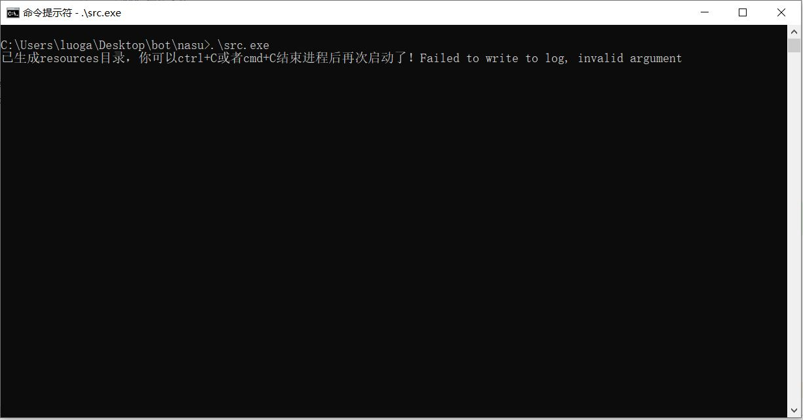
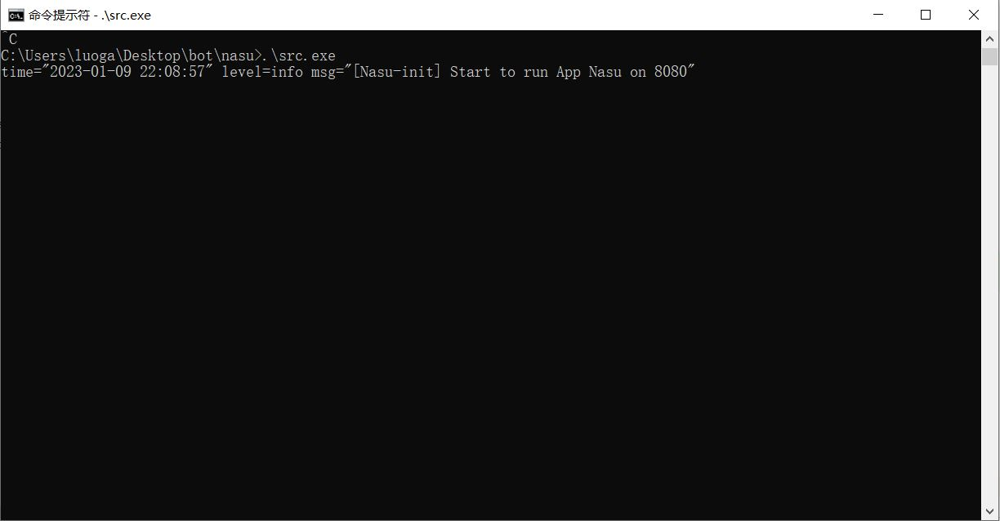
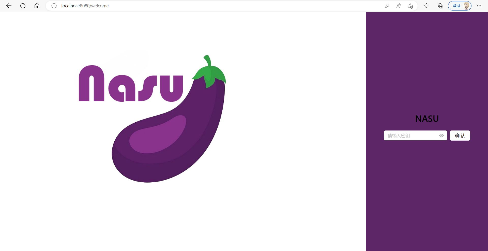
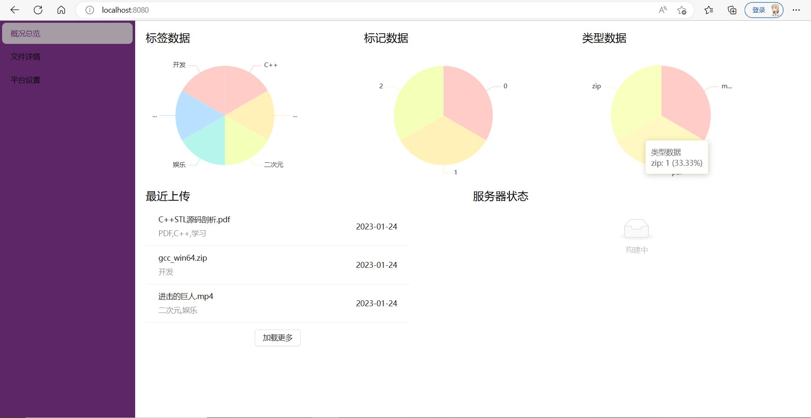
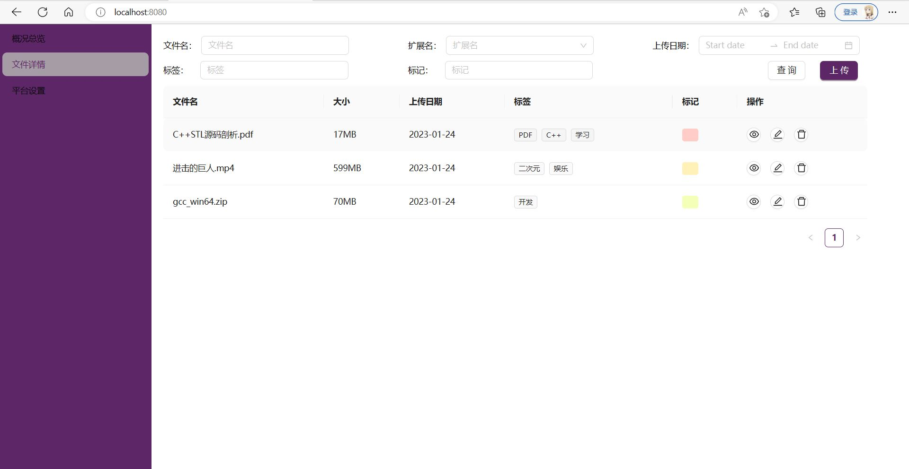
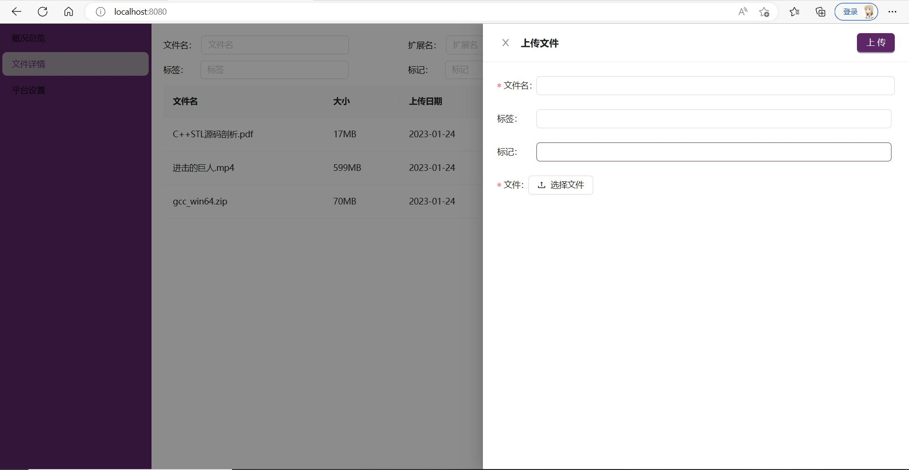
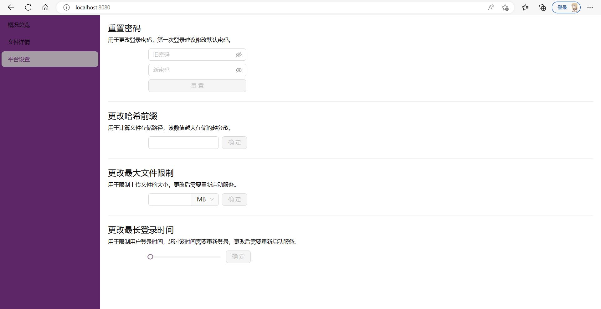

# Nasu: 面向个人的NAS软件

 </div>

[](https://goreportcard.com/report/github.com/littlebutt/nasu)         

Nasu是一款面向个人的NAS软件，其定位是网盘和传统NAS的结合。Nasu产生的目的是“云上存储，随时使用”，用户只要部署一次就可以像浏览网页一样上传和预览文件内容。和传统的网盘相比，其优点有一下几个方面：

- 安全：文件存储在网上可以做数据备份，而且不会因为审核丢失数据
- 高效：文件的上传下载完全依赖于网络环境，不会限流限速
- 便宜：自己部署的NAS平台，没有会员机制，成本只是服务器的成本

和传统的NAS相比也有以下特点：

- 便宜：不涉及NAS硬件，节省成本
- 灵活：只是个人使用，不需要大范围的运维

## 安装

### 下载安装

可以直接在右侧release页面选择适合自己操作系统的二进制可执行文件，直接在控制台运行即可

### 编译安装

由于Nasu是Golang编写的，需要提前准备好相应的环境。

首先，克隆仓库到本地

```shell
git clone https://github.com/littlebutt/nasu.git
```

然后进入目录下载依赖并编译程序

```shell
cd nasu
go mod download
go build nasu/src
```

### Docker安装

```shell
docker build -t nasu .
```

## 运行

首先在运行之前需要安装好sqlite3，并配置好环境变量。

然后直接在命令行中运行下载好的二进制可执行文件，第一次运行会生成resources目录，如下图所示：



这时候按 `CTRL+C` 或 `cmd+c` 停止运行。再次运行二进制可执行文件即可正确运行。



该二进制可执行文件还可以配合参数使用，具体如下；

```text

-p  --port  指定运行的端口，默认8080
-h  --host  指定运行的host，默认localhost。用处不大，因为只能支持本地运行
-d  --debug 指定DEBUG模式运行，默认false。会打印DEBUG相关日志，开启CORS跨域请求，一般用于排查  
```

## 使用

部署好后可以访问登录页面，初始密码是 **admin** 。



登录成功后进入主界面，主界面分为三块：概况总览、文件详情和平台设置。



概况总览可以查看文件的总统情况，包括自定义标签（Label）和颜色标记（Tag）、扩展名等。颜色标记是参考Mac OS的文件属性做的，用户可以简单归类方便检索。此外，还有最近上传的文件和服务器状况的概览（后续实现）。





文件详情可以查看上传的文件，也可以按照标签和标记等检索文件。同时也可以上传本地文件。



平台设置可以设置登录密码、哈希散列值（设置文件分布情况）、最大文件限制和最长登录时间（后两者需要重启服务，暂时找不到合适的热加载方案）。

## TODO

Nasu目前还在不断完善中，仍有以下一些想法没有实现：

- 文件备份机制
- 服务器状况概览
- ……

## Contribution

Nasu后端采用Golang开发，数据库采用Sqlite3，其主要框架工具如下：

- web框架: [Gin](https://github.com/gin-gonic/gin) 
- 测试框架: 原生自带配合 [gomock](https://github.com/golang/mock)
- ORM工具: [xorm](https://gitea.com/xorm/xorm)

Nasu前端采用typescript开发，其主要框架工具如下：

- 前端框架: [react](https://github.com/facebook/react)
- UI库: [antd](https://github.com/ant-design/ant-design)
- 路由组件: [react-router-dom](https://github.com/remix-run/react-router)

在开发的过程中，我发现其实比起主流的前端框架，Go原生的template更适合这种单体项目，但是目前仍然还是react那一套，有机会会迁移。

由于NAS这个词谐音日语ナス（nasu），本意是茄子的意思，所以图标就是一个茄子，主题色也是茄子的颜色。Nasu诞生于我在学习Modern C++过程中
的一个不成熟想法，想用C++实现一套快速的网络存储软件，然后发现我水平并不足以支撑用C++开发这套系统，但确实觉得这套工具很有用，遂改为Go开发。
目前项目仍处于萌芽状态，我希望能继续成长，但项目成长也需要更多人参与。如果你对项目感兴趣，或者想找项目练手丰富自己的简历，本人非常欢迎PR！


